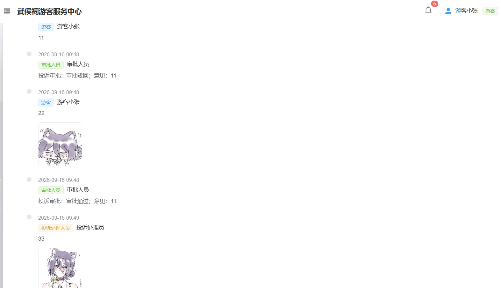
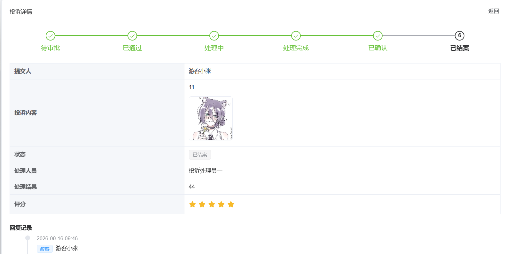
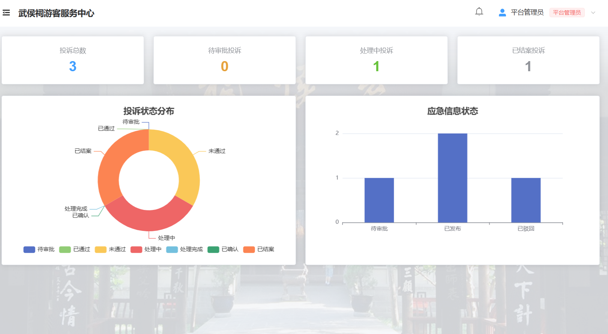

# 武侯祠游客服务中心

基于 Spring Boot + Vue 3 的武侯祠景区游客服务中心，面向游客、平台管理员、审批人员、投诉处理人员、酒店管理员多角色，提供游客投诉、旅游应急信息发布、酒店查询及营销、景区(点)及线路查询、餐饮娱乐及演出团体查询、天气及出行信息查询等功能。

> 本项目以 `docs/source/游客服务系统.docx` 为源需求，产出一套文档：
> - `docs/PRD.md`（产品需求文档）— 系统范围、角色权限、子系统、数据模型、接口
> - `docs/VERIFICATION.md`（功能验收指南）— 账号清单 + 分角色/业务闭环验证流程
> - `docs/测试文档.md`（测试文档）— 问题与解决记录 + 单测清单
> - `CONTEXT.md`（领域统一语言）— 术语、角色命名与领域决策
> - `docs/adr/`（架构决策记录）— 角色分离、地理范围、数据来源等不可逆决策
> 
> 文档见 [docs/](./docs/)，统一语言见 [CONTEXT.md](./CONTEXT.md)，决策见 [docs/adr/](./docs/adr/)。

## 功能预览

**① 投诉详情 · 回复记录**
投诉全流程时间线：游客提交 → 审批驳回 → 游客回复（含图片附件）→ 审批通过 → 处理人员处理（含附件），各环节按时间顺序排列，附件以缩略图就地展示。



**② 投诉详情 · 状态流转**
状态步骤条（待审批 → 已通过 → 处理中 → 处理完成 → 已确认 → 已结案）+ 投诉内容（含缩略图）、处理人员/结果与游客评分。



**③ 数据看板**
统计卡片（投诉总数 / 待审批 / 处理中 / 已结案）+ 投诉状态分布饼图 + 应急信息状态柱状图（ECharts）。



## 一、项目环境

| 组件       | 版本 / 位置                                            | 说明                                                         |
| ---------- | ------------------------------------------------------ | ------------------------------------------------------------ |
| 操作系统   | Windows 11                                             | —                                                            |
| JDK        | **17**（本机 `D:\ETjdk17`）                            | ⚠️ 必须 17；JDK 25 与 Lombok 1.18.30 冲突会报 `TypeTag :: UNKNOWN` |
| Maven      | 3.9.9（`D:\apache-maven-3.9.9`）                       | 构建后端                                                     |
| MySQL      | 8.0.46（`D:\mysql-8.0.46-winx64`）                     | 库名 `tourist_service`，账号 `root/123456`                   |
| Node / npm | 22.x / 10.x                                            | 构建前端                                                     |
| 后端       | Spring Boot 2.7.18 + MyBatis-Plus + JWT，端口 **8080** | 包名 `com.tourist`                                           |
| 前端       | Vue 3 + Vite + Element Plus + Pinia，端口 **5173**     | 目录 `frontend/`                                             |
| 数据库管理 | Navicat（可选）                                        | 导入/查看 `tourist_service`                                  |
| 后端 IDE   | IntelliJ IDEA（可选）                                  | 运行 `TouristApplication`                                    |
| 外部服务   | 高德 Web 服务（天气/路况，口径成都市武侯区）           | `amap.key` 已配置                                            |

**目录结构**

```
tourist-service/
├── frontend/         前端源码（Vue3 + Vite + Element Plus）
├── backend/          后端源码（Spring Boot 2.7 + MyBatis-Plus）
├── sql/              数据库脚本（init.sql：建库 + 建表 + 种子数据）
├── docs/             文档（PRD、复用评估、验收指南、ADR、项目说明、测试文档）
├── CONTEXT.md        领域术语表
└── README.md         项目入口
```

---

## 二、如何启动项目（任选一种）

> 数据库与后端二选一用 Navicat / IDEA 或命令行均可；前端用命令行。

### 1) 导入数据库

**方式 A：Navicat**

1. 新建连接：主机 `localhost`、端口 `3306`、用户名 `root`、密码 `123456`。
2. 右键连接 →「运行 SQL 文件…」→ 选 `sql/init.sql` → 执行。
3. 刷新可见库 **`tourist_service`**（21 张表）与 `sys_user` 中的 6 个账号。

**方式 B：命令行**

```bash
mysql -u root -p123456 < sql/init.sql
```

> 脚本幂等：自带 `SET FOREIGN_KEY_CHECKS=0` + `DROP TABLE IF EXISTS`，可重复执行（会重建数据）。

### 2) 启动后端（8080）

**方式 A：IDEA**

1. Open 选 `backend`（含 `pom.xml` 那层），等 Maven 依赖下载完。
2. 关键设置：
   - `Project Structure → Project`：SDK 选 **JDK 17**，Language level 17；
   - `Settings → Build → Compiler → Java Compiler`：target 17；
   - `Settings → Build Tools → Maven → Runner`：JRE = **JDK 17**；
   - `Settings → Build → Compiler → Annotation Processors`：勾选 **Enable annotation processing**（Lombok 必需）。
3. 运行 `src/main/java/com/tourist/TouristApplication.java`。
4. 控制台出现 `Started TouristApplication ... Tomcat started on port(s): 8080` 即成功。

**方式 B：命令行**

```bash
cd backend
export JAVA_HOME=D:/ETjdk17        # 关键：切到 JDK 17
mvn spring-boot:run                # 端口 8080
```

### 3) 启动前端（5173）

```bash
cd frontend
npm install
npm run dev                        # http://localhost:5173
```

> 浏览器打开 `http://localhost:5173`，标题为「武侯祠游客服务中心」。

### 4) 跑单元测试（可选）

```bash
cd backend
export JAVA_HOME=D:/ETjdk17
mvn test                           # 40 个单元测试，应全绿
```

---

## 三、现有账号及身份

> 密码统一 `123456`。登录后左侧菜单按角色自动切换。

| 用户名                  | 身份（角色）                     | 主要入口                                                     |
| ----------------------- | -------------------------------- | ------------------------------------------------------------ |
| `tourist1`              | 游客 `TOURIST`                   | 我的投诉、应急信息、景区服务、酒店、天气路况、订单详情       |
| `platform1`             | 平台管理员 `PLATFORM_ADMIN`      | 投诉分派/结案、应急信息管理、内容管理、酒店营销、数据看板、用户管理 |
| `approver1`             | 审批人员 `APPROVER`              | 投诉审批、应急信息审批                                       |
| `handler1` / `handler2` | 投诉处理人员 `COMPLAINT_HANDLER` | 待处理投诉                                                   |
| `hotel1`                | 酒店管理员 `HOTEL_ADMIN`         | 房态录入（房型/总量/基准已预定/价格）                        |

> 另：游客可在登录页右下角「注册账号」自助注册（新账号均为游客身份，如 `tourist2`）。

---

## 四、项目功能（按子系统）

| 子系统          | 功能                                                         | 相关角色            |
| --------------- | ------------------------------------------------------------ | ------------------- |
| 账号与权限      | 登录 / 注册(游客) / 忘记密码 / 修改密码 / 个人信息 / RBAC 权限、消息通知 | 全部                |
| 游客投诉        | 提交(含图片/视频)、回复(弹窗+附件)、审批(是否发布)、分派、处理、游客确认、结案、评价打分（全流程状态机 + 时间线） | 游客/审批/平台/处理 |
| 旅游应急信息    | 发布、审批(通过/驳回)、修改(回退重审)、删除；游客仅见「已通过且在有效期」 | 平台/审批/游客      |
| 酒店·查询与预订 | 星级/非星级酒店查询、酒店详情内选房型**预订**（入住/离开/人数/总价）、**订单详情**(可取消) | 游客                |
| 酒店·房态录入   | 按酒店维护房型（总房量/基准已预定/价格）、查看当日已预定与预订明细 | 酒店管理员          |
| 酒店·营销       | 录入/编辑(重新发布)/删除营销，发布后通知游客                 | 平台                |
| 景区服务查询    | 景点/旅游线路/餐饮娱乐/演出团体/景区交通（游客只读 + 平台维护） | 游客/平台           |
| 天气及出行      | 景区天气、路况（高德 Web 服务，武侯区）                      | 游客                |
| 数据看板        | 投诉/应急/酒店统计卡片 + ECharts 图表                        | 平台                |

---

## 五、操作流程

### 1) 投诉全流程（换账号依次操作）

| 步   | 账号      | 操作                               | 结果                           |
| ---- | --------- | ---------------------------------- | ------------------------------ |
| 1    | tourist1  | 我的投诉 → 提交投诉(可传图片/视频) | 状态「待审批」，审批人收到通知 |
| 2    | approver1 | 投诉审批 → 通过/驳回               | 「已通过」(发布) 或「未通过」  |
| 3    | platform1 | 投诉分派 → 选处理人                | 「处理中」，处理人收到通知     |
| 4    | handler1  | 待处理投诉 → 处理(填意见+可传附件) | 「处理完成」                   |
| 5    | tourist1  | 详情 → 确认处理意见                | 「已确认」                     |
| 6    | platform1 | 投诉结案 → 结案                    | 「已结案」                     |
| 7    | tourist1  | 详情 → 评分(1-5星)                 | 显示评分                       |

> 例外：**驳回后**游客回复 → 自动退回「待审批」再审批；**处理完成后**游客回复(未确认) → 自动退回「处理中」再处理。

### 2) 应急信息流程

平台管理员发布 → 审批人员审批 →（通过）游客在「应急信息」可见（仅当在有效期内）；被驳回时通知发布者。

### 3) 酒店预订流程

游客：酒店 → 选酒店 → 详情内点某房型「预订」→ 填入住/离开日期、人数 → 查看**总价=单价×(离开−入住+1)** → 确认「预订成功」→ 侧栏「订单详情」可查看/取消。
酒店管理员：房态录入 → 选酒店/日期 → 维护房型与「当日已预定」。

> 已预定 = 基准已预定 + 覆盖该日期的有效预订数（会随预订动态变化）。

### 4) 注册账号

登录页「注册账号」→ 填 用户名/手机号/邮箱/密码/请再次输入密码（两次一致才可点注册）→ 注册成功回到登录页。

### 5) 多角色同时测试

各浏览器**窗口独立**鉴权（`sessionStorage` 按标签页隔离）：开多个窗口，每个窗口登录一个角色即可互不影响（建议每窗口直接输地址打开，或先退出再登录另一角色）。
